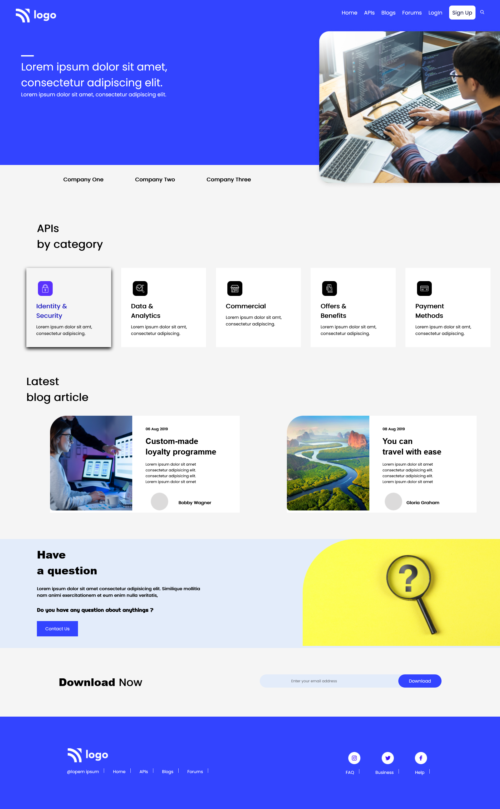
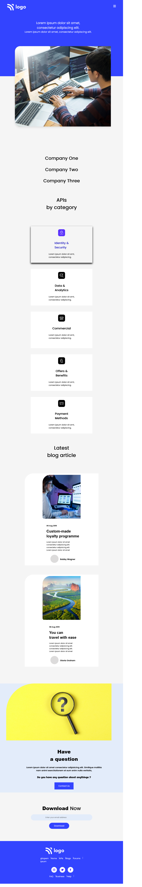
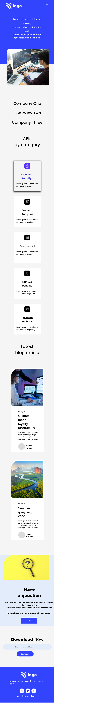

# Live_Class_Project9 -

This assignment was given as a task in [ineuron's](https://ineuron.ai/course/Full-Stack-JavaScript-Bootcamp-2.0) full stack javascript bootcamp by Hitesh Choudhary sir.

- This assignment is to replicate a landing page was supposed to be done using flexbox or grid.

- This project took around 3.5 hrs to complete.

## Tool/Technologies used -

- **Html**
- **Css**
- **Github**

&nbsp;

  

# Preview of the project-

## Large screen preview-

## Medium/small screen preview-

## Small screen preview -

**Learnings** - I had a thorough understanding about flex property :

> **flex-direction** , **flex-basis** , **align-items**, **justify-content**, **padding**, **margin**, **align-content** and different css styles and properties
